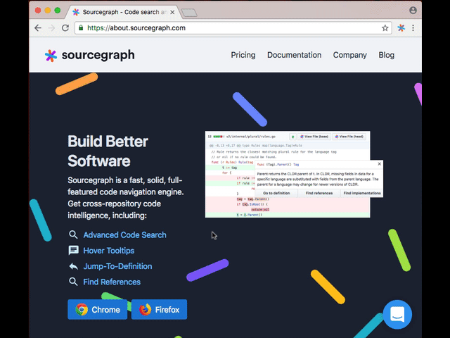

# Example: Building a "Hello, world!" Sourcegraph Extension

[Sourcegraph extensions](https://github.com/sourcegraph/sourcegraph-extension-api) let you add  features and show new kinds of information alongside your code on Sourcegraph.com, GitHub, and other code hosts.

This guide shows you how to create a simple Sourcegraph extension that:

- Shows a friendly "Hello, world! 🎉🎉🎉" message when you hover over code.
- Works on all code on GitHub (requires the Sourcegraph extension for [Chrome](https://chrome.google.com/webstore/detail/sourcegraph/dgjhfomjieaadpoljlnidmbgkdffpack) or [Firefox](https://addons.mozilla.org/en-US/firefox/addon/sourcegraph/)).
- Works on all code on Sourcegraph.com.
- Runs entirely client-side in the browser (your code remains local and is not sent to any server).

## Prerequisites

Sourcegraph extensions are written in TypeScript or JavaScript and are distributed as bundled JavaScript files that run on the client. For creation, publishing, and viewing, you need:

- **Creation**: Install [Node.js](https://nodejs.org) and [npm](https://npmjs.com)
- **Publishing**: Install the [Sourcegraph CLI (`src`)](https://github.com/sourcegraph/src-cli#installation) and create a [Sourcegraph.com account](https://sourcegraph.com/sign-up)
- **Viewing**: Install Sourcegraph extension for [Chrome](https://chrome.google.com/webstore/detail/sourcegraph/dgjhfomjieaadpoljlnidmbgkdffpack) or [Firefox](https://addons.mozilla.org/en-US/firefox/addon/sourcegraph/).

### Enable Sourcegraph Extensions

As Sourcegraph extensions are currently in alpha, you need to manually enable them for the browser extension by clicking on the Sourcegraph icon to the right of the address bar, then tick the **Use Sourcegraph extensions** checkbox.



## Write the extension

Create a new directory named `sourcegraph-hello-world`. You'll add 2 files to it.

First, create `package.json`, which includes the usual fields plus a few Sourcegraph-specific ones:

```json
{
  "name": "sourcegraph-hello-world",
  "publisher": "<SOUCEGRAPH USERNAME>",
  "title": "Hello, world!",
  "description": "Shows a friendly 'Hello, world!' message when you hover over code.",
  "activationEvents": [
    "*"
  ],
  "main": "dist/extension.js",
  "scripts": {
    "sourcegraph:prepublish": "parcel build src/extension.ts"
  },
  "devDependencies": {
    "parcel-bundler": "^1.9.7",
    "sourcegraph": "^16.0.0",
    "typescript": "^3.0.3"
  }
}
```

After creating `package.json`, run `npm install` to install dependencies.

Next, create a directory called `src` and inside that, create `extension.ts`, which is the extension's code:

```typescript
import * as sourcegraph from "sourcegraph";

export function activate(): void {
  sourcegraph.languages.registerHoverProvider(["*"], {
    provideHover: () => ({ contents: { value: "Hello, world! 🎉🎉🎉" } })
  })
}
```

That's all it takes to write an extension! Now you need to publish it so you (and other people) can use it.

## Publishing the Extension

Publishing an extension requires an [account on Sourcegraph.com](https://sourcegraph.com/sign-up) and configuring the [`src`](https://github.com/sourcegraph/src-cli) (Sourcegraph CLI) with an [access token](https://github.com/sourcegraph/src-cli#authentication).

Now that `src` has been configured with an access token, publish the extension by running the following in the `sourcegraph-hello-world` directory.

```bash
src extensions publish
```

Now the extension is published, let's use it.

## Use the Extension

After publishing the extension, visit the displayed URL. This is the extension's listing page on Sourcegraph.com. Anyone can visit this page to see more information about the extension and to start using it.

Click **Add** and select your username to start using it yourself. Try the following:

- Visit any code file on Sourcegraph (such as [this file](https://sourcegraph.com/github.com/ReactiveX/rxjs/-/blob/src/internal/observable/SubscribeOnObservable.ts)) and hover over code to see it say "Hello, world! 🎉🎉🎉".
- Visit any code file on GitHub (such as [this file](https://github.com/ReactiveX/rxjs/blob/HEAD/src/internal/observable/SubscribeOnObservable.ts)) and hover over code to see it say the same.

## Re-publishing the Extension

Let's add a `README.md` to provide information on this extension's capabilities.

```markdown
# Hello World

Shows a friendly 'Hello, world! 🎉🎉🎉' message when you hover over code, powered by the [Sourcegraph extension API](https://github.com/sourcegraph/sourcegraph-extension-api).

Works on GitHub when you install the browser extension for [Chrome](https://chrome.google.com/webstore/detail/sourcegraph/dgjhfomjieaadpoljlnidmbgkdffpack) or [Firefox](https://addons.mozilla.org/en-US/firefox/addon/sourcegraph/).
```

Now let's re-publish.

```bash
src extensions publish
```

The new version will be available instantly (or after a page reload on a page that's already running the old version).

## Next Steps

You've created your first Sourcegraph extension! Hopefully the first of many.

Now check out the [Sourcegraph extensions documentation](https://github.com/sourcegraph/sourcegraph-extensions) to see how to build more powerful extensions.

<!-- Uncomment after more samples have been added.
You you can also check-out other extensions in our [sample extensions repo](https://github.com/sourcegraph/sourcegraph-extension-samples/tree/master/hello-world).
-->